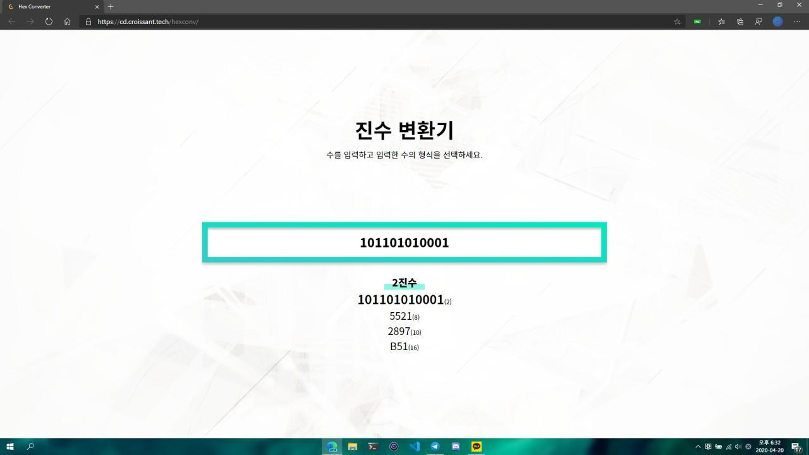

# Hex Converter

> 웹에서 쉽게 사용하는 진법 변환 계산기

https://cp.croissant.tech/hexconv/

## 주요기능

- 숫자를 입력하면 자동으로 입력된 수가 몇진수인지 감지합니다.
- 자동으로 감지한 진수는 가능한 범위 내에서 사용자가 조작할 수 있습니다.
- 숫자와 진수 정보를 바탕으로 2, 8, 10, 16진수 정보를 출력합니다.
